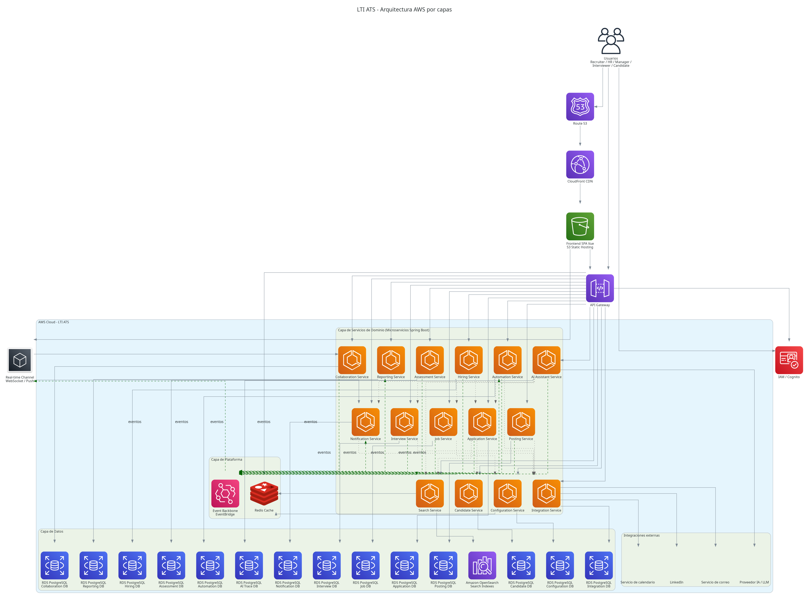
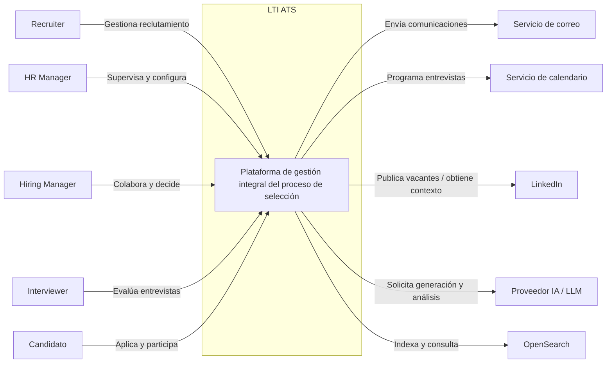
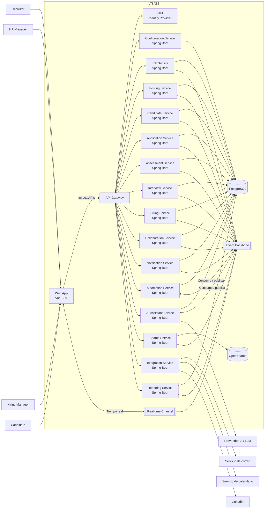
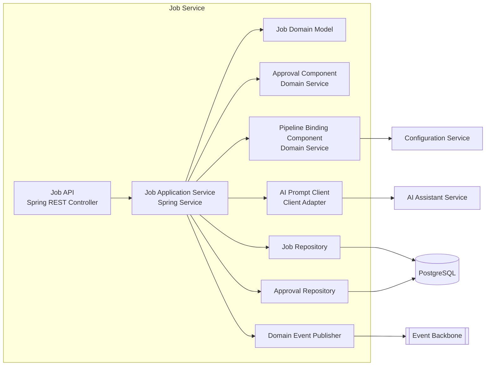
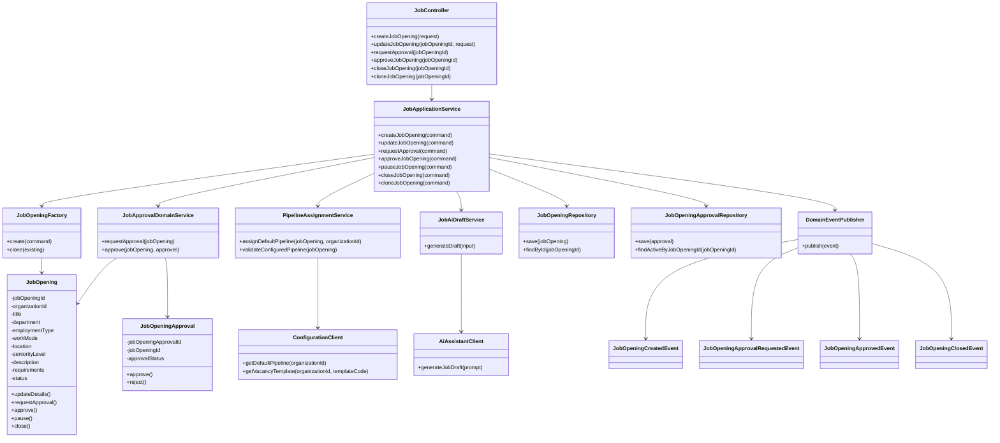

# Diseño de Alto Nivel del Sistema — LTI ATS
## Documento canónico de arquitectura con diagramas C4 en Mermaid

**Proyecto:** LTI ATS  
**Tipo de documento:** High Level Design (HLD) / Arquitectura de Solución  
**Versión:** 1.1  
**Estado:** Baseline inicial  
**Audiencia:** Arquitectura, Product Management, Desarrollo, QA, DevOps, Stakeholders del proyecto  

---

## 1. Propósito del documento

El presente documento define el **diseño de alto nivel del sistema LTI ATS**, alineado con el PRD, el modelo de casos de uso y el modelo de datos previamente establecidos.

Su objetivo es describir de forma estructurada y coherente:

- la arquitectura objetivo de la solución,
- los principios de diseño adoptados,
- la descomposición lógica en servicios,
- la interacción entre frontend, backend e integraciones externas,
- la estrategia de persistencia y búsqueda,
- la incorporación de capacidades de colaboración en tiempo real e IA desde la primera versión,
- y la vista arquitectónica del sistema mediante **diagramas C4 en formato Mermaid**.

---

## 2. Contexto y alcance arquitectónico

**LTI ATS** es una plataforma digital de gestión integral del proceso de selección de talento. El sistema cubre end-to-end el ciclo de recruiting:

1. **Creación de vacantes**
2. **Publicación en canales**
3. **Recepción de candidaturas**
4. **Revisión y evaluación**
5. **Pruebas online**
6. **Planificación de entrevistas**
7. **Selección y contratación**

Además, incorpora como capacidades diferenciales desde la primera versión:

- **colaboración en tiempo real**
- **automatización**
- **asistencia de IA**
- **workflows configurables por cliente**
- **búsqueda avanzada basada en OpenSearch/Elasticsearch**
- integraciones obligatorias con **correo, calendarios y LinkedIn**

El diseño responde a una **visión target completa**, aunque la entrega funcional pueda realizarse por incrementos.

---

## 3. Premisas de arquitectura

- **Modelo de despliegue inicial:** single-tenant
- **Estilo arquitectónico:** microservicios desde la primera versión
- **Cloud provider:** AWS
- **Base de datos principal:** PostgreSQL
- **Motor de búsqueda:** OpenSearch / Elasticsearch
- **Frontend:** Vue
- **Backend:** Spring Boot
- **IA:** integrada desde la primera versión
- **Colaboración en tiempo real:** requisito de MVP
- **Integraciones obligatorias v1:** correo, calendarios y LinkedIn
- **Acceso al dominio:** API Gateway + IAM
- **Configurabilidad:** workflows configurables por cliente desde el inicio
- **Horizonte del diseño:** visión target completa

---

## 4. Objetivos arquitectónicos

### 4.1 Escalabilidad funcional
Permitir evolución continua del producto sin acoplamiento excesivo entre dominios.

### 4.2 Separación clara de responsabilidades
Organizar la solución en dominios coherentes que faciliten mantenimiento, despliegue y ownership.

### 4.3 Flexibilidad para personalización por cliente
Soportar pipelines, plantillas, reglas y automatizaciones configurables por organización.

### 4.4 Trazabilidad end-to-end
Asegurar seguimiento completo del proceso de selección desde la apertura de vacante hasta la contratación.

### 4.5 Integración nativa con capacidades diferenciales
Incorporar de forma explícita búsqueda avanzada, IA y colaboración en tiempo real como piezas arquitectónicas de primer nivel.

### 4.6 Idoneidad para producción en AWS
Adoptar una estructura que permita evolucionar a operación productiva siguiendo buenas prácticas del mercado.

---

## 5. Principios de diseño

### 5.1 Domain-driven decomposition
La plataforma se descompone por dominios de negocio.

### 5.2 API-first
La interacción entre frontend, integraciones y servicios se diseña priorizando contratos bien definidos.

### 5.3 Event-driven where appropriate
Los cambios relevantes del proceso se publican como eventos de dominio para desacoplar automatizaciones, notificaciones, indexación y capacidades inteligentes.

### 5.4 Persistencia por servicio
Cada microservicio mantiene ownership sobre sus datos operativos.

### 5.5 Search as a dedicated capability
La búsqueda avanzada se apoya en OpenSearch, desacoplado de la persistencia transaccional principal.

### 5.6 Real-time by design
La colaboración en tiempo real se incorpora de forma nativa a la arquitectura.

### 5.7 IA como capacidad transversal gobernada
La IA se modela como capacidad centralizada/orquestada.

### 5.8 Configurabilidad por tenant
Aunque el despliegue inicial sea single-tenant, el modelo técnico queda preparado para evolución posterior.

---

## 6. Estilo arquitectónico propuesto

La solución se diseña bajo un enfoque de **frontend SPA + API Gateway + microservicios de dominio + integraciones externas + capacidades transversales**.

A alto nivel, la arquitectura se compone de:

- una **aplicación web SPA en Vue**
- un **API Gateway**
- un conjunto de **microservicios Spring Boot** organizados por dominios
- un **IAM** para autenticación y autorización
- **PostgreSQL** como persistencia relacional por servicio
- **OpenSearch** para búsqueda y filtrado avanzado
- un **bus de eventos**
- una **capa de tiempo real**
- una **capa de integración** con correo, calendarios y LinkedIn
- un **servicio de IA**

---

## 7. Dominios de negocio

- **Tenant & Configuration**
- **Identity & Access**
- **Job Management**
- **Candidate Management**
- **Application & Pipeline**
- **Assessment**
- **Interviewing**
- **Hiring Decision**
- **Collaboration & Notification**
- **Automation**
- **AI Assistant**
- **Search & Indexing**
- **Integration Hub**
- **Reporting & Insights**

---

## 8. Arquitectura lógica objetivo

### 8.1 Frontend
**Web Application (Vue)** para recruiters, HR managers, hiring managers, interviewers y administradores.

### 8.2 Capa de entrada
**API Gateway** como punto único de entrada y **IAM** para autenticación y autorización.

### 8.3 Microservicios principales
- Configuration Service
- Job Service
- Posting Service
- Candidate Service
- Application Service
- Assessment Service
- Interview Service
- Hiring Service
- Collaboration Service
- Notification Service
- Automation Service
- AI Assistant Service
- Search Service
- Integration Service
- Reporting Service

### 8.4 Persistencia
- **PostgreSQL** como fuente de verdad transaccional
- **OpenSearch** para búsqueda avanzada

### 8.5 Backbone asíncrono
Eventos de dominio para desacoplar notificaciones, automatizaciones, indexación y proyecciones.

### 8.6 Tiempo real
Canal push para comentarios, menciones, notificaciones, cambios de pipeline y tareas.

---

## 9. Mapeo de casos de uso a servicios

| Caso de uso | Servicios principales |
|---|---|
| UC-01 Gestionar vacantes | Job Service, Configuration Service, AI Assistant Service, Collaboration Service |
| UC-02 Gestionar publicación de ofertas | Posting Service, Integration Service, Job Service |
| UC-03 Gestionar candidaturas | Candidate Service, Application Service, Search Service |
| UC-04 Revisar y evaluar candidaturas | Application Service, Candidate Service, Search Service, AI Assistant Service |
| UC-05 Gestionar pruebas online | Assessment Service, Application Service, Integration Service |
| UC-06 Gestionar entrevistas | Interview Service, Integration Service, Collaboration Service, Notification Service |
| UC-07 Gestionar selección y contratación | Hiring Service, Interview Service, Application Service, Notification Service |
| UC-08 Colaborar en el proceso de selección | Collaboration Service, Notification Service |
| UC-09 Ejecutar automatizaciones del proceso | Automation Service, Notification Service, Integration Service |
| UC-10 Utilizar asistencia de IA | AI Assistant Service, Search Service, Job Service, Application Service, Interview Service |
| UC-11 Consultar métricas y seguimiento | Reporting Service, Search Service, servicios operativos |
| UC-12 Administrar configuración del sistema | Configuration Service, Identity & Access |

---

## 10. Integraciones externas

### 10.1 Correo
Notificaciones, invitaciones, recordatorios, ofertas y comunicaciones automáticas.

### 10.2 Calendarios
Consulta de disponibilidad, programación, replanificación e invitaciones de entrevista.

### 10.3 LinkedIn
Difusión de vacantes, trazabilidad de origen y posible enriquecimiento de contexto.

### 10.4 IA
Proveedor LLM encapsulado tras AI Assistant Service.

---

## 11. Configurabilidad por cliente

Ámbitos configurables clave:

- pipeline por vacante
- plantillas de vacante
- scorecards
- tipos de entrevista
- motivos de descarte
- reglas de automatización
- parámetros de IA
- catálogos funcionales
- canales de publicación disponibles

La configurabilidad debe centralizarse en **Configuration Service**.

---

## 12. Colaboración en tiempo real

Capacidades mínimas:

- comentarios visibles en tiempo real
- menciones con alerta inmediata
- notificaciones in-app
- actualización del estado del candidato en pipeline
- tareas compartidas
- refresco de vistas críticas sin recarga manual

---

## 13. Arquitectura de IA

### 13.1 AI Assistant Service
Servicio especializado para:
- recepción de solicitudes de IA
- construcción de contexto
- orquestación de prompts
- invocación a proveedor LLM
- postproceso y normalización
- trazabilidad de interacciones

### 13.2 Casos de uso principales
- generar borrador de vacante
- resumir candidatura
- evaluar ajuste candidato-vacante
- sugerir priorización
- proponer preguntas de entrevista
- consolidar feedback
- generar recomendación de decisión

---
# 14. Diagramas de Arquitectura

  

---

# 15. Diagramas C4 en Mermaid

## 15.1 C4 Nivel 1 — System Context

## 15.2 C4 Nivel 2 — Container Diagram

## 15.3 C4 Nivel 3 — Component Diagram del Job Service

## 15.4 C4 Nivel 4 — Code Diagram para UC-01 Gestionar vacantes

---

## 16. Vista de interacción de alto nivel para UC-01 Gestionar vacantes

1. El usuario crea la vacante desde la SPA.
2. La petición entra por el API Gateway y se enruta al **Job Service**.
3. El **Job Service** valida y persiste la vacante inicial.
4. El **Job Service** consulta a **Configuration Service** el pipeline o plantilla aplicable.
5. Si el usuario solicita apoyo de IA, el **Job Service** invoca a **AI Assistant Service**.
6. El **Job Service** publica el evento `JobOpeningCreated`.
7. **Search Service**, **Reporting Service**, **Automation Service** y **Collaboration/Notification** consumen el evento si procede.
8. El frontend recibe confirmación y, si aplica, actualización en tiempo real de vistas compartidas.

---

## 17. Decisiones arquitectónicas clave

- **Microservicios desde el inicio**
- **Single-tenant con diseño tenant-aware**
- **PostgreSQL + OpenSearch**
- **IA como servicio independiente**
- **Tiempo real como capacidad transversal**
- **Integration Hub**
- **Event backbone**

---

## 18. Riesgos arquitectónicos y mitigaciones

### 18.1 Complejidad inicial elevada
**Mitigación:** definir ownership claro, contratos explícitos y una granularidad razonable.

### 18.2 Riesgo de sobrefragmentación
**Mitigación:** evitar microservicios excesivamente pequeños.

### 18.3 Dependencia de integraciones externas
**Mitigación:** aislarlas tras Integration Service y desacoplar mediante eventos cuando sea posible.

### 18.4 Sincronización entre PostgreSQL y OpenSearch
**Mitigación:** consistencia eventual controlada y mecanismos de reindexación.

### 18.5 Gobernanza de IA
**Mitigación:** encapsular uso en AI Assistant Service y limitar la IA a asistencia.

---

## 19. Conclusión

La arquitectura propuesta para **LTI ATS** responde de forma coherente al análisis funcional realizado y a la visión de producto definida en el PRD.

La solución resultante se caracteriza por:

- una **descomposición por dominios de negocio** alineada con el proceso de recruiting
- una arquitectura **microservicios nativa en AWS**
- el uso combinado de **PostgreSQL** y **OpenSearch**
- integración obligatoria desde v1 con **correo, calendarios y LinkedIn**
- incorporación nativa de **IA** y **colaboración en tiempo real**
- una estructura preparada para evolucionar a producción y a escenarios de mayor complejidad funcional
