# Modelo de Casos de Uso — LTI ATS
## Documento canónico del sistema

**Proyecto:** LTI ATS  
**Tipo de documento:** Especificación funcional — Modelo de Casos de Uso  
**Versión:** 1.0  
**Estado:** Baseline inicial  
**Audiencia:** Negocio, Product Management, Análisis Funcional, Arquitectura, UX, Desarrollo, QA, Stakeholders del proyecto  

---

## 1. Propósito del documento

El presente documento define el **Modelo de Casos de Uso del sistema LTI ATS** y constituye la referencia canónica para la comprensión funcional de la solución desde la perspectiva de negocio y de los usuarios que interactúan con ella.

Su objetivo es describir de forma estructurada, coherente y entendible:

- el alcance funcional del sistema,
- los actores involucrados,
- los casos de uso de alto nivel,
- el desglose detallado por fase del proceso,
- las relaciones funcionales entre capacidades,
- y la trazabilidad conceptual necesaria para evolucionar posteriormente hacia requisitos, historias de usuario, diseño funcional, diseño técnico y pruebas.

Este documento ha sido elaborado con una doble finalidad:

1. ofrecer una **visión ejecutiva y comprensible** del comportamiento general del ATS;
2. proporcionar un **nivel de detalle suficiente** para servir de base a la definición funcional del producto.

---

## 2. Contexto del sistema

**LTI ATS** es una plataforma de gestión integral del proceso de selección de talento, diseñada para cubrir de extremo a extremo el ciclo de reclutamiento y contratación.

El sistema contempla las fases principales del proceso de selección:

1. **Creación de vacantes**
2. **Publicación en portales, web corporativa y redes**
3. **Recepción de candidaturas**
4. **Revisión y evaluación de solicitudes**
5. **Gestión de pruebas online**
6. **Planificación y gestión de entrevistas**
7. **Selección final y contratación**

Adicionalmente, la solución incorpora capacidades transversales que aumentan su valor diferencial:

- colaboración en tiempo real entre participantes del proceso,
- automatización de tareas y flujos,
- asistencia de IA en actividades clave,
- y seguimiento mediante métricas e indicadores de rendimiento.

---

## 3. Objetivo del modelo de casos de uso

El modelo de casos de uso persigue representar cómo interactúan los actores con el sistema para alcanzar objetivos de negocio concretos dentro del proceso de selección.

En este contexto, los casos de uso permiten:

- delimitar el comportamiento funcional esperado del sistema,
- identificar responsabilidades de cada actor,
- estructurar el producto en capacidades funcionales coherentes,
- facilitar la comunicación entre negocio y tecnología,
- y establecer una base estable para futuras actividades de especificación y construcción.

---

## 4. Criterios de modelado

Para garantizar claridad, mantenibilidad y utilidad práctica, el modelo se ha estructurado en **dos niveles**:

### 4.1 Nivel 1 — Vista global del sistema
Representa el conjunto de capacidades principales del ATS mediante casos de uso generales. Esta vista permite comprender el sistema de manera rápida y ejecutiva.

### 4.2 Nivel 2 — Desglose funcional por fase
Desarrolla cada caso de uso general mediante subcasos de uso más concretos, respetando la nomenclatura del nivel superior y manteniendo coherencia terminológica y funcional.

### 4.3 Principios aplicados
- **Coherencia de nomenclatura** entre niveles
- **Orientación a objetivos de negocio**
- **Cobertura end-to-end del proceso de recruiting**
- **Separación clara entre capacidades troncales y transversales**
- **Suficiente detalle sin perder legibilidad**

---

## 5. Alcance funcional del sistema

El alcance funcional cubierto por este modelo incluye:

- gestión de vacantes,
- publicación de ofertas,
- recepción y consolidación de candidaturas,
- revisión y evaluación de candidatos,
- gestión de pruebas online,
- coordinación de entrevistas,
- selección final y contratación,
- colaboración entre participantes,
- automatización de tareas,
- asistencia de inteligencia artificial,
- consulta de métricas,
- y administración funcional de la plataforma.

No forman parte del alcance detallado de este documento los procesos posteriores de onboarding, nómina o administración laboral, aunque sí se contempla la posible transferencia de información hacia sistemas externos de onboarding o HRIS.

---

## 6. Actores del sistema

## 6.1 Actores principales

### Recruiter
Usuario operativo responsable de gestionar vacantes, revisar candidaturas, coordinar el pipeline y asegurar el avance del proceso de selección.

### HR Manager
Responsable de supervisión funcional y operativa del área de selección. Participa en el gobierno del proceso, la revisión de métricas, la definición de reglas y la configuración funcional del sistema.

### Hiring Manager
Responsable de negocio que participa en la definición del perfil, la revisión de candidatos, la valoración de entrevistas y la decisión final de contratación.

### Interviewer
Usuario que interviene en una o varias entrevistas y registra feedback estructurado sobre los candidatos evaluados.

### Candidato
Persona externa que aplica a una vacante, aporta documentación, realiza pruebas, participa en entrevistas y recibe la decisión final del proceso.

### Administrador del sistema
Usuario encargado de la administración general de la plataforma, incluyendo configuración, roles, permisos, catálogos, integraciones y parametrización transversal.

---

## 6.2 Actores externos y sistemas integrados

### Job Boards / Portales de empleo
Canales externos de difusión de vacantes y captación de candidaturas.

### Web corporativa
Canal propio de publicación y recepción de aplicaciones.

### Redes sociales / plataformas profesionales
Canales externos de difusión de oportunidades de empleo.

### Servicio de calendario
Sistema externo utilizado para la coordinación y reserva de entrevistas.

### Plataforma de assessment
Sistema externo utilizado para lanzar y recibir resultados de pruebas online.

### Servicio de correo / notificaciones
Canal utilizado para el envío de comunicaciones, alertas y recordatorios automáticos.

### Motor de IA
Servicio de apoyo inteligente para redacción, análisis, clasificación, resumen y recomendación.

### HRIS / sistema de onboarding
Sistema externo receptor de la información del candidato contratado.

---

## 7. Vista global del modelo de casos de uso

El modelo de nivel 1 representa las capacidades funcionales principales del sistema.

  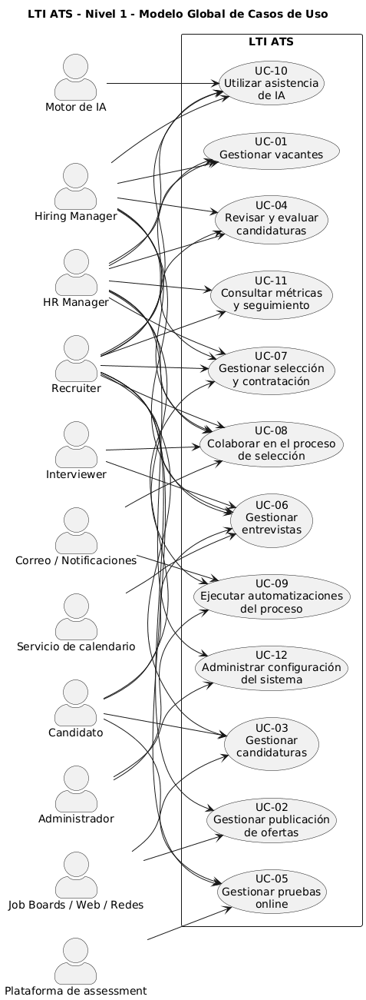

### UC-01 Gestionar vacantes
Permite crear, editar, definir, aprobar, pausar, clonar y cerrar vacantes.

### UC-02 Gestionar publicación de ofertas
Permite preparar y publicar ofertas en canales internos y externos, así como gestionar su estado y procedencia.

### UC-03 Gestionar candidaturas
Permite recibir, registrar, consolidar y consultar la información relativa a las candidaturas y perfiles de candidatos.

### UC-04 Revisar y evaluar candidaturas
Permite filtrar, revisar, valorar, clasificar, comparar y descartar candidatos dentro del pipeline.

### UC-05 Gestionar pruebas online
Permite seleccionar, asignar, lanzar y revisar evaluaciones online asociadas a candidatos.

### UC-06 Gestionar entrevistas
Permite planificar, coordinar, ejecutar y evaluar entrevistas dentro del proceso de selección.

### UC-07 Gestionar selección y contratación
Permite identificar finalistas, consolidar la decisión final, gestionar ofertas y cerrar el proceso de contratación.

### UC-08 Colaborar en el proceso de selección
Permite compartir comentarios, menciones, tareas, evaluaciones y notificaciones entre participantes internos.

### UC-09 Ejecutar automatizaciones del proceso
Permite definir y ejecutar reglas automáticas vinculadas a eventos del proceso de recruiting.

### UC-10 Utilizar asistencia de IA
Permite usar capacidades de IA para redacción, resumen, matching, priorización, generación de preguntas y apoyo a la decisión.

### UC-11 Consultar métricas y seguimiento
Permite consultar dashboards, indicadores de pipeline, eficiencia, rendimiento por fuente y exportación de información.

### UC-12 Administrar configuración del sistema
Permite mantener la parametrización general del sistema, incluyendo usuarios, roles, plantillas, catálogos, integraciones, IA y automatizaciones.

---

## 8. Matriz de relación entre actores y casos de uso de nivel 1

| Actor | Casos de uso principales |
|---|---|
| Recruiter | UC-01, UC-02, UC-03, UC-04, UC-05, UC-06, UC-07, UC-08, UC-10, UC-11 |
| HR Manager | UC-01, UC-04, UC-07, UC-08, UC-09, UC-10, UC-11, UC-12 |
| Hiring Manager | UC-01, UC-04, UC-06, UC-07, UC-08, UC-10 |
| Interviewer | UC-06, UC-08 |
| Candidato | UC-03, UC-05, UC-06, UC-07 |
| Administrador | UC-09, UC-12 |
| Sistemas externos | UC-02, UC-03, UC-05, UC-06, UC-08, UC-09, UC-10 |

---

## 9. Desglose detallado de casos de uso por capacidad

## 9.1 UC-01 Gestionar vacantes

### Objetivo
Permitir iniciar y preparar un proceso de selección a partir de una necesidad de contratación formalizada.

### Actores principales
Recruiter, HR Manager, Hiring Manager

### Descripción funcional
Este caso de uso agrupa las funcionalidades necesarias para definir una vacante y dejarla preparada para su activación y posterior publicación. Incluye tanto la definición de la necesidad como su configuración operativa.

### Subcasos de uso

  

#### UC-01.1 Crear vacante
Registrar una nueva vacante con los datos necesarios para iniciar el proceso.

#### UC-01.2 Editar vacante
Modificar la información de una vacante mientras su estado lo permita.

#### UC-01.3 Definir perfil del puesto
Especificar requisitos, competencias, experiencia, condiciones y demás atributos del puesto.

#### UC-01.4 Configurar pipeline de selección
Definir las fases por las que pasarán los candidatos para esa vacante.

#### UC-01.5 Solicitar aprobación de vacante
Enviar la vacante al flujo de validación interna.

#### UC-01.6 Aprobar vacante
Autorizar formalmente la vacante para su activación.

#### UC-01.7 Pausar vacante
Suspender temporalmente la vacante sin perder trazabilidad.

#### UC-01.8 Cerrar vacante
Finalizar la vacante por cobertura, cancelación o cierre del proceso.

#### UC-01.9 Clonar vacante
Crear una nueva vacante reutilizando una existente como base.

---

## 9.2 UC-02 Gestionar publicación de ofertas

### Objetivo
Difundir una vacante en los canales adecuados para captar candidaturas.

### Actores principales
Recruiter

### Actores externos
Job Boards, Web corporativa, Redes y plataformas profesionales

### Descripción funcional
Este caso de uso recoge las funciones orientadas a preparar, publicar y controlar la presencia de una oferta en los distintos canales de captación.

### Subcasos de uso

#### UC-02.1 Preparar contenido de publicación
Adaptar el contenido de la oferta al canal o formato de publicación.

#### UC-02.2 Publicar en web corporativa
Difundir la vacante en el portal corporativo de empleo.

#### UC-02.3 Publicar en job boards
Publicar la vacante en portales externos de empleo.

#### UC-02.4 Publicar en redes y plataformas profesionales
Difundir la vacante en redes sociales y plataformas profesionales.

#### UC-02.5 Configurar formulario de candidatura
Definir preguntas, campos y documentos requeridos para la aplicación.

#### UC-02.6 Gestionar estado de publicación
Activar, actualizar, pausar o retirar la publicación según sea necesario.

#### UC-02.7 Registrar canal de origen
Asociar la procedencia de cada candidatura con el canal correspondiente.

---

## 9.3 UC-03 Gestionar candidaturas

### Objetivo
Recibir, registrar, consolidar y consultar toda la información relacionada con una candidatura y con el candidato asociado.

### Actores principales
Recruiter, Candidato

### Actores externos
Web corporativa, Job Boards

### Descripción funcional
Este caso de uso cubre la entrada de candidaturas desde diferentes canales, así como la creación y mantenimiento de una ficha única de candidato.

### Subcasos de uso

#### UC-03.1 Recibir candidatura
Capturar una nueva candidatura enviada por el candidato.

#### UC-03.2 Registrar candidatura manualmente
Dar de alta una candidatura por intervención manual del equipo interno.

#### UC-03.3 Crear perfil de candidato
Consolidar una ficha unificada del candidato.

#### UC-03.4 Adjuntar CV y documentación
Registrar y almacenar documentos del candidato.

#### UC-03.5 Parsear CV
Extraer automáticamente información estructurada desde el currículum.

#### UC-03.6 Detectar candidaturas duplicadas
Identificar si existe ya un registro previo del mismo candidato.

#### UC-03.7 Asociar candidatura a vacante
Vincular la candidatura con la vacante correspondiente.

#### UC-03.8 Gestionar consentimiento y privacidad
Registrar consentimientos y condiciones de tratamiento de datos personales.

#### UC-03.9 Consultar ficha del candidato
Visualizar el perfil consolidado, su historial y la información asociada.

---

## 9.4 UC-04 Revisar y evaluar candidaturas

### Objetivo
Analizar candidaturas y decidir su avance, permanencia o descarte dentro del proceso de selección.

### Actores principales
Recruiter, Hiring Manager

### Descripción funcional
Este caso de uso recoge las capacidades de revisión y evaluación funcional de candidatos, incluyendo filtros, scorecards, clasificación y decisiones de avance.

### Subcasos de uso

#### UC-04.1 Filtrar candidaturas
Aplicar criterios de búsqueda, segmentación y priorización.

#### UC-04.2 Revisar perfil del candidato
Analizar el conjunto de información del perfil.

#### UC-04.3 Valorar ajuste al puesto
Determinar el grado de encaje del candidato con la vacante.

#### UC-04.4 Registrar scorecard
Documentar una valoración estructurada.

#### UC-04.5 Clasificar candidato
Asignar prioridad, etiquetas o inclusión en shortlist.

#### UC-04.6 Cambiar fase del candidato
Mover al candidato entre etapas del pipeline.

#### UC-04.7 Descartar candidato
Cerrar la candidatura indicando la causa o motivo correspondiente.

#### UC-04.8 Comparar candidaturas
Contrastar varios perfiles en paralelo para facilitar la decisión.

#### UC-04.9 Solicitar revisión al manager
Requerir la intervención o valoración del Hiring Manager.

---

## 9.5 UC-05 Gestionar pruebas online

### Objetivo
Ejecutar evaluaciones objetivas que complementen el proceso de selección.

### Actores principales
Recruiter, Candidato

### Actores externos
Plataforma de assessment

### Descripción funcional
Este caso de uso cubre el ciclo completo de gestión de pruebas: elección, asignación, invitación, realización, recepción de resultados y decisión posterior.

### Subcasos de uso

#### UC-05.1 Seleccionar tipo de prueba
Elegir el assessment adecuado para la vacante o perfil evaluado.

#### UC-05.2 Asignar prueba al candidato
Asociar la evaluación a uno o varios candidatos.

#### UC-05.3 Enviar invitación a prueba
Comunicar al candidato el acceso a la evaluación.

#### UC-05.4 Realizar prueba online
Permitir la ejecución de la prueba por parte del candidato.

#### UC-05.5 Recibir resultado de prueba
Registrar o importar el resultado de la evaluación.

#### UC-05.6 Revisar resultado de prueba
Analizar la información devuelta por la prueba.

#### UC-05.7 Decidir continuidad tras prueba
Determinar si el candidato avanza, queda en espera o se descarta.

---

## 9.6 UC-06 Gestionar entrevistas

### Objetivo
Coordinar, ejecutar y documentar entrevistas del proceso de selección.

### Actores principales
Recruiter, Hiring Manager, Interviewer, Candidato

### Actores externos
Servicio de calendario

### Descripción funcional
Este caso de uso abarca la definición, programación, notificación, ejecución y evaluación de entrevistas.

### Subcasos de uso

#### UC-06.1 Definir tipo de entrevista
Determinar la naturaleza de la entrevista: telefónica, técnica, cultural, panel u otra.

#### UC-06.2 Proponer disponibilidad
Consultar o proponer franjas compatibles entre participantes.

#### UC-06.3 Programar entrevista
Registrar la entrevista y bloquear agenda.

#### UC-06.4 Notificar entrevista
Enviar invitaciones y recordatorios a los participantes.

#### UC-06.5 Reprogramar entrevista
Modificar fecha, hora o asistentes.

#### UC-06.6 Ejecutar entrevista
Celebrar la entrevista planificada.

#### UC-06.7 Registrar feedback de entrevista
Documentar la valoración posterior a la entrevista.

#### UC-06.8 Consolidar feedback de entrevistadores
Unificar y sintetizar las valoraciones registradas.

#### UC-06.9 Decidir continuidad tras entrevista
Determinar el avance, repetición o descarte del candidato.

---

## 9.7 UC-07 Gestionar selección y contratación

### Objetivo
Formalizar la decisión final del proceso y gestionar la oferta al candidato seleccionado.

### Actores principales
Recruiter, HR Manager, Hiring Manager, Candidato

### Actores externos
HRIS / sistema de onboarding

### Descripción funcional
Este caso de uso cubre la fase final del proceso de selección, desde la identificación de finalistas hasta el cierre del proceso y la transferencia al sistema posterior.

### Subcasos de uso

#### UC-07.1 Identificar candidatos finalistas
Seleccionar los perfiles que pasan a la decisión final.

#### UC-07.2 Comparar candidatos finalistas
Analizar comparativamente los finalistas.

#### UC-07.3 Consolidar decisión de selección
Registrar la decisión final de contratación o no contratación.

#### UC-07.4 Aprobar oferta
Validar internamente las condiciones de contratación.

#### UC-07.5 Generar oferta al candidato
Preparar la propuesta formal dirigida al candidato.

#### UC-07.6 Enviar oferta
Remitir la oferta al candidato.

#### UC-07.7 Registrar aceptación o rechazo
Actualizar el resultado de la oferta enviada.

#### UC-07.8 Cerrar proceso de selección
Finalizar el proceso vinculado a la vacante.

#### UC-07.9 Transferir a onboarding o HRIS
Enviar la información necesaria al sistema posterior a la contratación.

---

## 9.8 UC-08 Colaborar en el proceso de selección

### Objetivo
Facilitar la coordinación y comunicación entre los participantes internos del proceso.

### Actores principales
Recruiter, HR Manager, Hiring Manager, Interviewer

### Descripción funcional
Este caso de uso agrupa las funcionalidades colaborativas que permiten compartir contexto, pedir acción y mantener a los participantes alineados.

### Subcasos de uso

#### UC-08.1 Comentar candidatura
Registrar comentarios sobre un candidato.

#### UC-08.2 Comentar vacante
Registrar observaciones sobre una vacante o proceso.

#### UC-08.3 Mencionar usuario
Llamar la atención de otro participante sobre un elemento concreto.

#### UC-08.4 Compartir evaluación
Hacer visible una valoración o scorecard para otros usuarios.

#### UC-08.5 Asignar tarea
Delegar una acción pendiente.

#### UC-08.6 Consultar tareas pendientes
Visualizar acciones asignadas o pendientes de resolución.

#### UC-08.7 Recibir notificaciones
Recibir alertas, eventos o recordatorios relevantes para el proceso.

---

## 9.9 UC-09 Ejecutar automatizaciones del proceso

### Objetivo
Reducir tareas manuales mediante reglas y acciones automáticas vinculadas al proceso de selección.

### Actores principales
Administrador, HR Manager

### Actores externos
Correo / Notificaciones, Job Boards, Calendario

### Descripción funcional
Este caso de uso contempla la definición, activación, ejecución y trazabilidad de automatizaciones aplicadas al proceso de recruiting.

### Subcasos de uso

#### UC-09.1 Definir regla de automatización
Configurar condiciones, disparadores y acciones.

#### UC-09.2 Activar automatización
Poner una regla en funcionamiento.

#### UC-09.3 Ejecutar acción automática
Lanzar la acción definida al cumplirse la condición.

#### UC-09.4 Enviar comunicación automática
Remitir emails o avisos generados por una automatización.

#### UC-09.5 Asignar responsable automáticamente
Determinar de forma automática el usuario o responsable adecuado.

#### UC-09.6 Cambiar estado automáticamente
Modificar estados de candidaturas o vacantes sin intervención manual.

#### UC-09.7 Registrar ejecución de automatización
Mantener la trazabilidad de las acciones automáticas ejecutadas.

---

## 9.10 UC-10 Utilizar asistencia de IA

### Objetivo
Aumentar la eficiencia y la calidad de decisión mediante funciones de apoyo inteligente.

### Actores principales
Recruiter, HR Manager, Hiring Manager

### Actores externos
Motor de IA

### Descripción funcional
Este caso de uso engloba las capacidades inteligentes del sistema orientadas a asistir a los usuarios en tareas de análisis, resumen, priorización, generación de contenido y recomendación.

### Subcasos de uso

#### UC-10.1 Generar borrador de oferta
Elaborar una primera versión de una vacante a partir de parámetros básicos.

#### UC-10.2 Resumir candidatura
Generar una síntesis ejecutiva de la información del candidato.

#### UC-10.3 Evaluar ajuste candidato-vacante
Proponer el grado de encaje entre un perfil y una vacante.

#### UC-10.4 Sugerir priorización de candidatos
Proponer un orden de revisión o una shortlist inicial.

#### UC-10.5 Proponer preguntas de entrevista
Generar preguntas adaptadas al rol y al perfil evaluado.

#### UC-10.6 Consolidar feedback
Sintetizar valoraciones procedentes de varios usuarios.

#### UC-10.7 Generar recomendación de decisión
Ofrecer una recomendación razonada con base en la evidencia disponible.

---

## 9.11 UC-11 Consultar métricas y seguimiento

### Objetivo
Aportar visibilidad sobre el rendimiento operativo y la evolución del proceso de selección.

### Actores principales
Recruiter, HR Manager

### Descripción funcional
Este caso de uso reúne las capacidades de reporting, seguimiento y análisis orientadas a la mejora continua y a la toma de decisiones.

### Subcasos de uso

#### UC-11.1 Consultar dashboard de vacantes
Visualizar el estado y distribución de vacantes.

#### UC-11.2 Consultar métricas de pipeline
Analizar ratios y evolución por fase del proceso.

#### UC-11.3 Consultar métricas de eficiencia
Medir tiempos, productividad y cuellos de botella.

#### UC-11.4 Consultar rendimiento por fuente
Comparar la efectividad de los canales de captación.

#### UC-11.5 Exportar información
Extraer información para análisis o reporte externo.

---

## 9.12 UC-12 Administrar configuración del sistema

### Objetivo
Mantener el gobierno funcional y la parametrización general de la plataforma.

### Actores principales
Administrador, HR Manager

### Descripción funcional
Este caso de uso cubre la administración transversal del sistema y sus elementos configurables.

### Subcasos de uso

#### UC-12.1 Gestionar usuarios
Crear, modificar, activar o desactivar usuarios.

#### UC-12.2 Gestionar roles y permisos
Definir perfiles de acceso y autorizaciones.

#### UC-12.3 Gestionar catálogos
Mantener listas maestras, estados, motivos y tipos configurables.

#### UC-12.4 Gestionar plantillas
Administrar plantillas de vacantes, correos, scorecards y comunicaciones.

#### UC-12.5 Gestionar integraciones
Configurar conexiones con sistemas y plataformas externas.

#### UC-12.6 Parametrizar IA
Definir disponibilidad, límites o comportamiento de las funciones inteligentes.

#### UC-12.7 Parametrizar automatizaciones
Configurar y mantener las reglas automáticas del sistema.

---

## 10. Relaciones funcionales entre casos de uso

Para asegurar una comprensión integral del sistema, es importante explicitar las relaciones entre las capacidades definidas.

### Relaciones de secuencia funcional
- **UC-01 Gestionar vacantes** precede normalmente a **UC-02 Gestionar publicación de ofertas**.
- **UC-02 Gestionar publicación de ofertas** habilita la captación de candidaturas contemplada en **UC-03 Gestionar candidaturas**.
- **UC-03 Gestionar candidaturas** alimenta el análisis realizado en **UC-04 Revisar y evaluar candidaturas**.
- **UC-04 Revisar y evaluar candidaturas** puede conducir a **UC-05 Gestionar pruebas online** o a **UC-06 Gestionar entrevistas**, en función del diseño del pipeline.
- **UC-05 Gestionar pruebas online** puede constituir una fase previa a **UC-06 Gestionar entrevistas**.
- **UC-06 Gestionar entrevistas** conduce a **UC-07 Gestionar selección y contratación**.

### Relaciones transversales
- **UC-08 Colaborar en el proceso de selección** es una capacidad transversal aplicable a vacantes, candidaturas, entrevistas y selección final.
- **UC-09 Ejecutar automatizaciones del proceso** puede actuar sobre múltiples fases operativas del sistema.
- **UC-10 Utilizar asistencia de IA** presta soporte a varias capacidades troncales del proceso.
- **UC-11 Consultar métricas y seguimiento** consume información generada por el conjunto de casos de uso operativos.
- **UC-12 Administrar configuración del sistema** sustenta el comportamiento configurable del resto del modelo.

---

## 11. Vista resumida del flujo de negocio

Desde una perspectiva de proceso, el comportamiento funcional del sistema puede resumirse del siguiente modo:

1. se crea y configura una vacante,
2. la vacante se publica en los canales definidos,
3. se reciben y consolidan candidaturas,
4. se revisan y evalúan los perfiles,
5. se aplican pruebas cuando el proceso lo requiere,
6. se coordinan y registran entrevistas,
7. se toma una decisión final y se formaliza la contratación.

Durante todo este recorrido, el sistema ofrece colaboración, automatización, asistencia de IA, trazabilidad y visibilidad analítica.

---

## 12. Consideraciones de consistencia del modelo

El modelo se ha construido siguiendo criterios de consistencia semántica y estructural:

- los casos de uso del **nivel 2** respetan la nomenclatura del **nivel 1**;
- los nombres utilizados se orientan a objetivos de negocio y no a implementaciones técnicas;
- las capacidades transversales se mantienen separadas de las fases operativas para facilitar comprensión y reutilización conceptual;
- el modelo cubre tanto la perspectiva operativa del recruiter como la participación del negocio, del candidato y de los sistemas externos;
- se ha priorizado una granularidad equilibrada que permita evolucionar el modelo a artefactos posteriores sin hacerlo innecesariamente complejo.

---

## 13. Conclusión

El presente modelo de casos de uso define una base funcional sólida, coherente y escalable para el sistema **LTI ATS**.

El modelo es:

- **completo**, porque cubre el proceso end-to-end de selección;
- **entendible**, porque separa claramente la vista global y el desglose detallado;
- **trazable**, porque permite evolucionar hacia requisitos, historias de usuario y pruebas;
- **alineado con negocio**, porque refleja objetivos reales de los usuarios y del proceso de recruiting.

Por su carácter canónico, este documento debe considerarse la referencia principal para la evolución funcional del sistema, y cualquier ampliación o modificación futura del alcance deberá mantener la coherencia de nomenclatura y estructura aquí establecida.

---

# Anexo A — Diagramas Mermaid del modelo de casos de uso

## A.1 Diagrama de casos de uso — Nivel 1

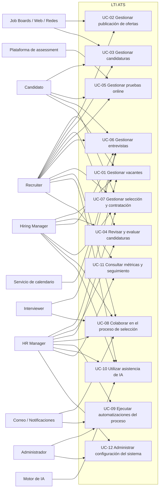

## A.2 Diagrama UC-01 Gestionar vacantes

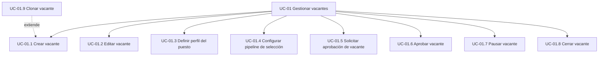

## A.3 Diagrama UC-02 Gestionar publicación de ofertas

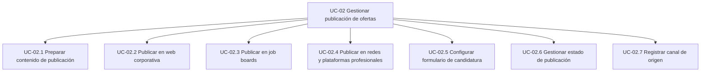

## A.4 Diagrama UC-03 Gestionar candidaturas

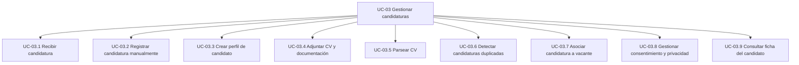

## A.5 Diagrama UC-04 Revisar y evaluar candidaturas

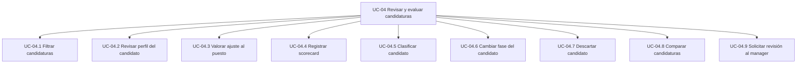

## A.6 Diagrama UC-05 Gestionar pruebas online

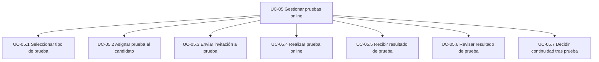

## A.7 Diagrama UC-06 Gestionar entrevistas

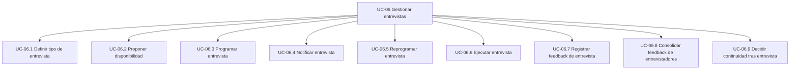

## A.8 Diagrama UC-07 Gestionar selección y contratación

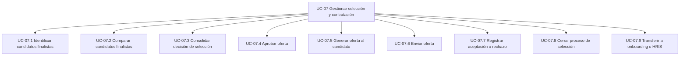

## A.9 Diagrama UC-08 Colaborar en el proceso de selección

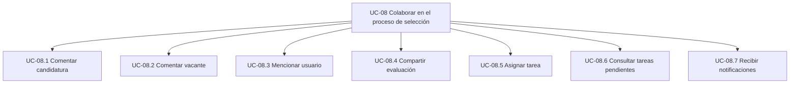

## A.10 Diagrama UC-09 Ejecutar automatizaciones del proceso

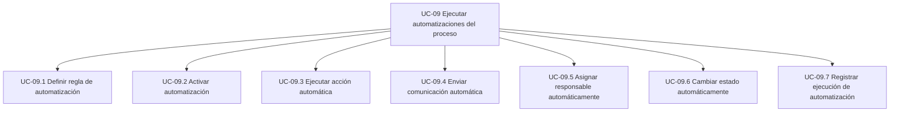

## A.11 Diagrama UC-10 Utilizar asistencia de IA

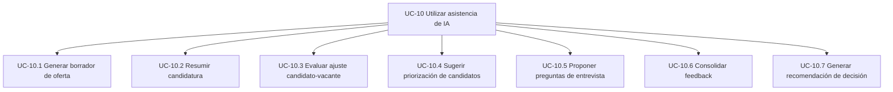

## A.12 Diagrama UC-11 Consultar métricas y seguimiento

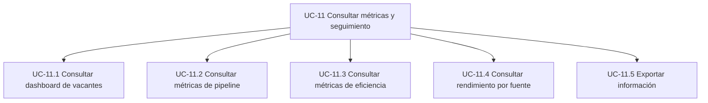

## A.13 Diagrama UC-12 Administrar configuración del sistema

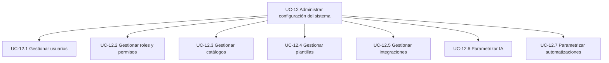

## A.14 Vista resumida del flujo de negocio

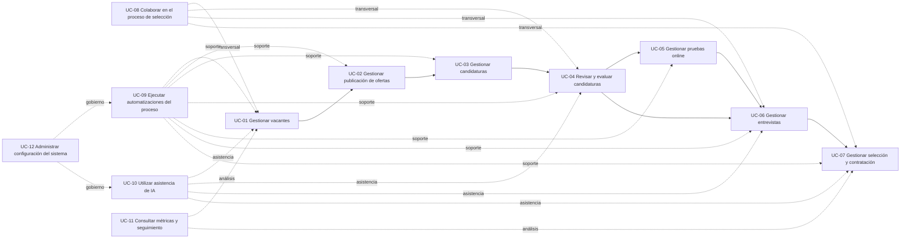
