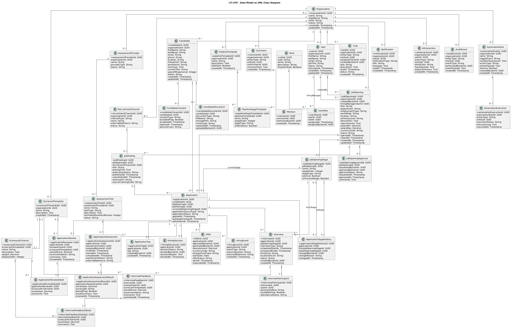

# Modelo de Datos — LTI ATS
## Documento canónico del sistema

**Proyecto:** LTI ATS  
**Tipo de documento:** Especificación de datos — Modelo de Datos Relacional  
**Versión:** 1.0  
**Estado:** Baseline inicial  
**Audiencia:** Arquitectura, Análisis Funcional, Desarrollo, QA, DevOps, Seguridad, Stakeholders del proyecto  

---

## 1. Propósito del documento

El presente documento define el **Modelo de Datos canónico de LTI ATS** y constituye la referencia principal para la estructura de persistencia de la aplicación.

Su finalidad es establecer, de forma formal y consistente:

- las entidades del dominio,
- sus atributos principales,
- las relaciones entre entidades,
- las reglas de cardinalidad,
- los criterios de normalización,
- y las decisiones de diseño que soportan el funcionamiento integral del sistema.

Este documento debe servir como base para:

- diseño lógico y físico de la base de datos,
- construcción de servicios de negocio,
- definición de APIs y contratos de integración,
- trazabilidad con el modelo funcional,
- y evolución controlada de la solución.

---

## 2. Contexto del dominio

**LTI ATS** es una plataforma de gestión integral del proceso de selección de talento. Su modelo de datos debe soportar el ciclo completo del recruiting:

1. creación de vacantes,
2. publicación multicanal,
3. recepción de candidaturas,
4. revisión y evaluación de solicitudes,
5. gestión de pruebas online,
6. planificación y seguimiento de entrevistas,
7. selección y contratación final.

Además, el sistema incorpora capacidades transversales tales como:

- colaboración entre usuarios internos,
- automatización de procesos,
- asistencia de IA,
- reporting y métricas,
- configuración administrativa,
- y trazabilidad de eventos relevantes.

---

## 3. Objetivos del modelo de datos

El modelo de datos debe cumplir los siguientes objetivos:

- representar correctamente el dominio funcional del ATS,
- mantener consistencia e integridad referencial,
- permitir evolución funcional del producto,
- soportar trazabilidad completa del proceso de selección,
- facilitar explotación analítica,
- permitir integración con sistemas externos,
- y asegurar una base robusta para escenarios multiusuario y de alta concurrencia.

---

## 4. Alcance del modelo

El alcance cubierto por este modelo incluye:

- organizaciones y usuarios internos,
- roles y permisos,
- vacantes,
- etapas del pipeline,
- publicaciones de ofertas,
- candidatos,
- candidaturas,
- documentación adjunta,
- evaluaciones y scorecards,
- pruebas online y resultados,
- entrevistas y feedback,
- decisiones de selección y ofertas,
- colaboración y notificaciones,
- automatizaciones,
- asistencia de IA,
- auditoría funcional,
- y reporting operacional básico.

Quedan fuera del alcance detallado de este modelo, aunque se consideran integrables, los procesos completos de:

- nómina,
- administración contractual posterior,
- gestión laboral,
- desempeño,
- y onboarding avanzado.

---

## 5. Principios de diseño

El modelo propuesto se ha construido con los siguientes principios:

### 5.1 Diseño relacional normalizado
Se prioriza un modelo relacional normalizado, orientado a minimizar redundancia y preservar consistencia.

### 5.2 Separación entre entidades maestras, operativas y transversales
Se diferencian claramente:
- datos maestros o de referencia,
- entidades transaccionales del proceso de recruiting,
- y entidades transversales de colaboración, automatización, IA y auditoría.

### 5.3 Trazabilidad end-to-end
Cada candidatura debe poder seguirse desde su origen hasta la decisión final.

### 5.4 Flexibilidad configurable
El modelo contempla parametrización de pipelines, scorecards, catálogos y automatizaciones.

### 5.5 Preparación para integraciones
Se incluyen estructuras que permiten interoperar con job boards, calendarios, plataformas de assessment, correo, IA y HRIS.

### 5.6 Escalabilidad conceptual
El modelo está diseñado para crecer funcionalmente sin romper sus fundamentos.

---

## 6. Vista general del dominio de datos

A nivel conceptual, el modelo se articula en torno a los siguientes bloques:

### 6.1 Estructura organizativa y seguridad
Define organizaciones, usuarios, roles y asignaciones.

### 6.2 Reclutamiento y vacantes
Modela la creación y gestión de posiciones abiertas y su configuración de pipeline.

### 6.3 Captación y candidaturas
Modela candidatos, aplicaciones, canales de origen y documentación asociada.

### 6.4 Evaluación
Recoge scorecards, revisiones, pruebas y resultados.

### 6.5 Entrevistas
Modela entrevistas, participantes y feedback asociado.

### 6.6 Selección final
Representa finalistas, decisiones, ofertas y contratación.

### 6.7 Capacidades transversales
Incluye colaboración, automatizaciones, IA, notificaciones y auditoría.

---

## 7. Entidades principales del modelo

  

## 7.1 Organización y seguridad

### ORGANIZATION
Representa la empresa o tenant que utiliza la plataforma.

**Atributos principales:**
- `organization_id` (PK)
- `name`
- `legal_name`
- `tax_id`
- `status`
- `created_at`
- `updated_at`

### USER
Representa a un usuario interno del sistema.

**Atributos principales:**
- `user_id` (PK)
- `organization_id` (FK)
- `first_name`
- `last_name`
- `email`
- `job_title`
- `status`
- `last_login_at`
- `created_at`
- `updated_at`

### ROLE
Representa un rol funcional o de seguridad.

**Atributos principales:**
- `role_id` (PK)
- `code`
- `name`
- `description`
- `is_system_role`

### USER_ROLE
Relaciona usuarios con roles.

**Atributos principales:**
- `user_role_id` (PK)
- `user_id` (FK)
- `role_id` (FK)
- `assigned_at`
- `assigned_by_user_id` (FK)

---

## 7.2 Vacantes y pipeline

### JOB_OPENING
Representa una vacante o requisición de contratación.

**Atributos principales:**
- `job_opening_id` (PK)
- `organization_id` (FK)
- `created_by_user_id` (FK)
- `hiring_manager_user_id` (FK)
- `title`
- `department`
- `employment_type`
- `work_mode`
- `location`
- `seniority_level`
- `description`
- `requirements`
- `salary_min`
- `salary_max`
- `currency_code`
- `status`
- `opened_at`
- `closed_at`
- `created_at`
- `updated_at`

### JOB_OPENING_APPROVAL
Representa el flujo de aprobación interna de una vacante.

**Atributos principales:**
- `job_opening_approval_id` (PK)
- `job_opening_id` (FK)
- `requested_by_user_id` (FK)
- `approved_by_user_id` (FK)
- `approval_status`
- `requested_at`
- `approved_at`
- `comments`

### PIPELINE_TEMPLATE
Plantilla reusable de pipeline de selección.

**Atributos principales:**
- `pipeline_template_id` (PK)
- `organization_id` (FK)
- `name`
- `description`
- `is_default`
- `created_at`

### PIPELINE_STAGE_TEMPLATE
Etapas configurables dentro de una plantilla de pipeline.

**Atributos principales:**
- `pipeline_stage_template_id` (PK)
- `pipeline_template_id` (FK)
- `name`
- `stage_order`
- `stage_type`
- `is_mandatory`

### JOB_OPENING_STAGE
Instancia de etapa concreta aplicada a una vacante.

**Atributos principales:**
- `job_opening_stage_id` (PK)
- `job_opening_id` (FK)
- `name`
- `stage_order`
- `stage_type`
- `is_active`
- `is_terminal_stage`

---

## 7.3 Publicación y captación

### RECRUITMENT_CHANNEL
Canal de captación o publicación.

**Atributos principales:**
- `recruitment_channel_id` (PK)
- `organization_id` (FK)
- `channel_type`
- `name`
- `external_reference`
- `status`

### JOB_POSTING
Publicación concreta de una vacante en un canal.

**Atributos principales:**
- `job_posting_id` (PK)
- `job_opening_id` (FK)
- `recruitment_channel_id` (FK)
- `title`
- `posting_text`
- `publication_status`
- `published_at`
- `unpublished_at`
- `external_url`
- `source_tracking_code`

---

## 7.4 Candidatos y candidaturas

### CANDIDATE
Representa a una persona candidata en la base de talento.

**Atributos principales:**
- `candidate_id` (PK)
- `organization_id` (FK)
- `first_name`
- `last_name`
- `email`
- `phone`
- `location`
- `linkedin_url`
- `portfolio_url`
- `summary`
- `current_title`
- `years_of_experience`
- `status`
- `created_at`
- `updated_at`

### CANDIDATE_CONSENT
Registra consentimientos y tratamiento de datos del candidato.

**Atributos principales:**
- `candidate_consent_id` (PK)
- `candidate_id` (FK)
- `consent_type`
- `accepted_flag`
- `accepted_at`
- `expires_at`
- `policy_version`

### CANDIDATE_DOCUMENT
Documentación adjunta del candidato.

**Atributos principales:**
- `candidate_document_id` (PK)
- `candidate_id` (FK)
- `document_type`
- `file_name`
- `storage_path`
- `mime_type`
- `uploaded_at`
- `uploaded_by_user_id` (FK, nullable)

### APPLICATION
Representa la candidatura de un candidato a una vacante concreta.

**Atributos principales:**
- `application_id` (PK)
- `candidate_id` (FK)
- `job_opening_id` (FK)
- `job_posting_id` (FK, nullable)
- `current_job_opening_stage_id` (FK)
- `application_source_type`
- `application_status`
- `applied_at`
- `last_stage_change_at`
- `withdrawn_at`

### APPLICATION_STAGE_HISTORY
Histórico de movimiento de una candidatura por el pipeline.

**Atributos principales:**
- `application_stage_history_id` (PK)
- `application_id` (FK)
- `from_job_opening_stage_id` (FK, nullable)
- `to_job_opening_stage_id` (FK)
- `changed_by_user_id` (FK)
- `change_reason`
- `changed_at`

### APPLICATION_TAG
Etiquetado flexible de candidaturas.

**Atributos principales:**
- `application_tag_id` (PK)
- `application_id` (FK)
- `tag`
- `created_by_user_id` (FK)
- `created_at`

---

## 7.5 Evaluación y scorecards

### SCORECARD_TEMPLATE
Plantilla de evaluación estructurada.

**Atributos principales:**
- `scorecard_template_id` (PK)
- `organization_id` (FK)
- `name`
- `description`
- `created_at`

### SCORECARD_CRITERION
Criterios de una plantilla de scorecard.

**Atributos principales:**
- `scorecard_criterion_id` (PK)
- `scorecard_template_id` (FK)
- `name`
- `description`
- `weight`
- `display_order`

### APPLICATION_REVIEW
Revisión estructurada de una candidatura.

**Atributos principales:**
- `application_review_id` (PK)
- `application_id` (FK)
- `reviewer_user_id` (FK)
- `scorecard_template_id` (FK, nullable)
- `overall_score`
- `recommendation`
- `comments`
- `reviewed_at`

### APPLICATION_REVIEW_DETAIL
Detalle por criterio de una revisión.

**Atributos principales:**
- `application_review_detail_id` (PK)
- `application_review_id` (FK)
- `scorecard_criterion_id` (FK)
- `score_value`
- `comments`

---

## 7.6 Pruebas online

### ASSESSMENT_PROVIDER
Proveedor o plataforma de pruebas.

**Atributos principales:**
- `assessment_provider_id` (PK)
- `organization_id` (FK, nullable)
- `name`
- `provider_type`
- `status`

### ASSESSMENT_TEST
Catálogo de pruebas disponibles.

**Atributos principales:**
- `assessment_test_id` (PK)
- `assessment_provider_id` (FK)
- `name`
- `test_type`
- `description`
- `estimated_duration_minutes`
- `status`

### APPLICATION_ASSESSMENT
Asignación de una prueba a una candidatura.

**Atributos principales:**
- `application_assessment_id` (PK)
- `application_id` (FK)
- `assessment_test_id` (FK)
- `assigned_by_user_id` (FK)
- `invited_at`
- `started_at`
- `completed_at`
- `assessment_status`
- `external_reference`

### APPLICATION_ASSESSMENT_RESULT
Resultado de la prueba.

**Atributos principales:**
- `application_assessment_result_id` (PK)
- `application_assessment_id` (FK)
- `score_value`
- `score_label`
- `passed_flag`
- `result_summary`
- `received_at`

---

## 7.7 Entrevistas

### INTERVIEW
Representa una entrevista asociada a una candidatura.

**Atributos principales:**
- `interview_id` (PK)
- `application_id` (FK)
- `job_opening_stage_id` (FK)
- `interview_type`
- `scheduled_start_at`
- `scheduled_end_at`
- `time_zone`
- `location_or_link`
- `status`
- `created_by_user_id` (FK)
- `created_at`

### INTERVIEW_PARTICIPANT
Participantes internos o externos de una entrevista.

**Atributos principales:**
- `interview_participant_id` (PK)
- `interview_id` (FK)
- `user_id` (FK, nullable)
- `participant_role`
- `candidate_flag`
- `attendance_status`

### INTERVIEW_FEEDBACK
Feedback posterior a una entrevista.

**Atributos principales:**
- `interview_feedback_id` (PK)
- `interview_id` (FK)
- `reviewer_user_id` (FK)
- `scorecard_template_id` (FK, nullable)
- `overall_score`
- `recommendation`
- `comments`
- `submitted_at`

### INTERVIEW_FEEDBACK_DETAIL
Detalle por criterio del feedback de entrevista.

**Atributos principales:**
- `interview_feedback_detail_id` (PK)
- `interview_feedback_id` (FK)
- `scorecard_criterion_id` (FK)
- `score_value`
- `comments`

---

## 7.8 Selección y contratación

### HIRING_DECISION
Decisión final asociada a una candidatura.

**Atributos principales:**
- `hiring_decision_id` (PK)
- `application_id` (FK)
- `decision_status`
- `decided_by_user_id` (FK)
- `decision_reason`
- `decided_at`

### OFFER
Oferta emitida al candidato.

**Atributos principales:**
- `offer_id` (PK)
- `application_id` (FK)
- `approved_by_user_id` (FK)
- `generated_by_user_id` (FK)
- `salary_amount`
- `currency_code`
- `employment_type`
- `start_date`
- `offer_status`
- `sent_at`
- `responded_at`

### HIRING_EVENT
Evento de cierre de contratación o transferencia.

**Atributos principales:**
- `hiring_event_id` (PK)
- `application_id` (FK)
- `event_type`
- `external_system`
- `external_reference`
- `created_at`

---

## 7.9 Colaboración y notificaciones

### COMMENT
Comentario funcional sobre candidatura, vacante u otro objeto de negocio.

**Atributos principales:**
- `comment_id` (PK)
- `organization_id` (FK)
- `entity_type`
- `entity_id`
- `author_user_id` (FK)
- `comment_text`
- `created_at`

### MENTION
Mención de usuarios dentro de un comentario.

**Atributos principales:**
- `mention_id` (PK)
- `comment_id` (FK)
- `mentioned_user_id` (FK)
- `created_at`

### TASK
Tarea interna asociada al proceso de selección.

**Atributos principales:**
- `task_id` (PK)
- `organization_id` (FK)
- `entity_type`
- `entity_id`
- `assigned_to_user_id` (FK)
- `created_by_user_id` (FK)
- `title`
- `description`
- `due_at`
- `status`
- `created_at`

### NOTIFICATION
Notificación generada por eventos del sistema.

**Atributos principales:**
- `notification_id` (PK)
- `organization_id` (FK)
- `user_id` (FK)
- `notification_type`
- `title`
- `message`
- `read_at`
- `created_at`

---

## 7.10 Automatización e IA

### AUTOMATION_RULE
Regla configurable de automatización.

**Atributos principales:**
- `automation_rule_id` (PK)
- `organization_id` (FK)
- `name`
- `trigger_event`
- `condition_expression`
- `action_type`
- `action_payload`
- `is_active`
- `created_by_user_id` (FK)
- `created_at`

### AUTOMATION_EXECUTION
Ejecución registrada de una automatización.

**Atributos principales:**
- `automation_execution_id` (PK)
- `automation_rule_id` (FK)
- `entity_type`
- `entity_id`
- `execution_status`
- `execution_log`
- `executed_at`

### AI_INTERACTION
Interacción de usuarios con capacidades de IA.

**Atributos principales:**
- `ai_interaction_id` (PK)
- `organization_id` (FK)
- `user_id` (FK)
- `entity_type`
- `entity_id`
- `ai_use_case`
- `input_payload`
- `output_summary`
- `created_at`

---

## 7.11 Auditoría

### AUDIT_EVENT
Registro de eventos relevantes para trazabilidad funcional y operativa.

**Atributos principales:**
- `audit_event_id` (PK)
- `organization_id` (FK)
- `entity_type`
- `entity_id`
- `event_type`
- `performed_by_user_id` (FK, nullable)
- `event_payload`
- `created_at`

---

## 8. Relaciones principales del modelo

A continuación se describen las relaciones más relevantes del dominio.

### 8.1 Organización y usuarios
- Una **ORGANIZATION** tiene muchos **USER**.
- Un **USER** puede tener muchos **ROLE** a través de **USER_ROLE**.

### 8.2 Vacantes
- Una **ORGANIZATION** tiene muchas **JOB_OPENING**.
- Una **JOB_OPENING** puede tener cero o muchas **JOB_OPENING_APPROVAL**.
- Una **JOB_OPENING** puede tener muchas **JOB_OPENING_STAGE**.
- Una **PIPELINE_TEMPLATE** tiene muchas **PIPELINE_STAGE_TEMPLATE**.
- Una **JOB_OPENING** puede derivar sus etapas de una plantilla, pero persiste sus propias instancias operativas en **JOB_OPENING_STAGE**.

### 8.3 Publicación
- Una **JOB_OPENING** puede tener muchas **JOB_POSTING**.
- Un **RECRUITMENT_CHANNEL** puede usarse en muchas **JOB_POSTING**.

### 8.4 Candidatos y candidaturas
- Una **ORGANIZATION** tiene muchos **CANDIDATE**.
- Un **CANDIDATE** puede tener muchos **CANDIDATE_DOCUMENT** y muchos **CANDIDATE_CONSENT**.
- Un **CANDIDATE** puede aplicar a muchas **JOB_OPENING** mediante **APPLICATION**.
- Una **JOB_OPENING** puede recibir muchas **APPLICATION**.
- Una **APPLICATION** pertenece a un único **CANDIDATE** y a una única **JOB_OPENING**.
- Una **APPLICATION** puede tener muchas entradas en **APPLICATION_STAGE_HISTORY**, **APPLICATION_TAG**, **APPLICATION_REVIEW**, **APPLICATION_ASSESSMENT**, **INTERVIEW**, **HIRING_DECISION**, **OFFER** y **HIRING_EVENT** según la evolución del proceso.

### 8.5 Evaluación
- Una **SCORECARD_TEMPLATE** tiene muchos **SCORECARD_CRITERION**.
- Una **APPLICATION_REVIEW** puede basarse en una **SCORECARD_TEMPLATE**.
- Una **APPLICATION_REVIEW** tiene muchos **APPLICATION_REVIEW_DETAIL**.
- Un **INTERVIEW_FEEDBACK** puede basarse en una **SCORECARD_TEMPLATE** y tiene muchos **INTERVIEW_FEEDBACK_DETAIL**.

### 8.6 Pruebas e entrevistas
- Una **APPLICATION** puede tener muchas **APPLICATION_ASSESSMENT**.
- Una **APPLICATION_ASSESSMENT** puede tener un **APPLICATION_ASSESSMENT_RESULT**.
- Una **APPLICATION** puede tener muchas **INTERVIEW**.
- Una **INTERVIEW** puede tener muchos **INTERVIEW_PARTICIPANT** y muchos **INTERVIEW_FEEDBACK**.

### 8.7 Selección
- Una **APPLICATION** puede tener cero o una decisión final vigente en **HIRING_DECISION**.
- Una **APPLICATION** puede tener cero o varias **OFFER** en función del histórico.
- Una **APPLICATION** puede generar uno o varios **HIRING_EVENT**.

### 8.8 Capacidades transversales
- Un comentario, tarea, notificación, automatización o interacción de IA puede referenciar entidades de negocio mediante el patrón `entity_type + entity_id`.
- La **AUDIT_EVENT** permite trazar cambios y eventos relevantes sobre cualquier entidad del sistema.

---

## 9. Reglas de integridad y negocio relevantes

### 9.1 Integridad organizativa
Toda entidad operativa perteneciente al dominio de un cliente debe quedar asociada, directa o indirectamente, a una **ORGANIZATION**.

### 9.2 Unicidad de usuario
El correo electrónico del usuario debe ser único dentro del sistema o, en su defecto, dentro del tenant organizativo definido.

### 9.3 Unicidad de candidato
Se recomienda controlar duplicidad de candidatos por combinación de email, teléfono y/o identificadores externos, según reglas de negocio.

### 9.4 Integridad de candidaturas
No debe existir más de una candidatura activa idéntica para el mismo candidato y la misma vacante, salvo que el negocio permita reaplicación controlada.

### 9.5 Integridad de pipeline
Toda candidatura debe tener una etapa actual válida perteneciente al pipeline de su vacante.

### 9.6 Trazabilidad de movimientos
Todo cambio de etapa relevante debe reflejarse en **APPLICATION_STAGE_HISTORY**.

### 9.7 Integridad de evaluación
Los detalles de scorecard deben referenciar criterios válidos de la plantilla asociada.

### 9.8 Integridad de entrevistas
Toda entrevista debe pertenecer a una candidatura existente y, cuando aplique, a una etapa válida del pipeline.

### 9.9 Integridad de oferta
Una oferta solo puede existir para candidaturas que hayan alcanzado una etapa habilitante del proceso.

### 9.10 Auditoría
Los eventos funcionalmente relevantes deben registrarse en **AUDIT_EVENT** para trazabilidad y cumplimiento.

---

## 10. Consideraciones de diseño físico recomendadas

Aunque este documento define el modelo lógico, se recomiendan las siguientes decisiones para el diseño físico:

### 10.1 Claves primarias
Uso de claves surrogate (`BIGINT` o `UUID`) según estrategia global de arquitectura.

### 10.2 Índices recomendados
Deben contemplarse índices, como mínimo, sobre:
- claves foráneas,
- `USER.email`,
- `CANDIDATE.email`,
- `APPLICATION(job_opening_id, application_status)`,
- `APPLICATION(candidate_id, job_opening_id)`,
- `JOB_OPENING.status`,
- `INTERVIEW.scheduled_start_at`,
- `NOTIFICATION(user_id, read_at)`.

### 10.3 Campos de auditoría técnica
Se recomienda incluir en tablas operativas:
- `created_at`,
- `updated_at`,
- `created_by`,
- `updated_by`,
cuando resulte apropiado.

### 10.4 Soft delete
Para entidades maestras o sensibles, valorar borrado lógico mediante campos como `deleted_at` o `is_active`.

### 10.5 Particionado futuro
En escenarios de alto volumen, considerar particionado para:
- auditoría,
- notificaciones,
- históricos de etapas,
- interacciones de IA.

---

## 11. Consideraciones analíticas

El modelo relacional operativo debe facilitar explotación analítica posterior. Para ello:

- los estados deben modelarse con claridad,
- los eventos de transición deben conservarse,
- las fechas críticas deben persistirse de forma explícita,
- y la procedencia de candidaturas debe ser trazable desde **JOB_POSTING** y **RECRUITMENT_CHANNEL**.

Esto permitirá calcular métricas como:
- time to hire,
- time in stage,
- conversión por fase,
- rendimiento por fuente,
- tasa de aceptación de oferta,
- productividad por recruiter,
- y uso de automatizaciones o IA.

---

## 12. Conclusión

El modelo de datos definido para **LTI ATS** proporciona una base sólida, normalizada y escalable para soportar el ciclo completo de selección de talento.

El diseño propuesto:

- cubre el dominio funcional del ATS de extremo a extremo,
- mantiene consistencia relacional,
- favorece la trazabilidad del proceso,
- contempla extensibilidad para integraciones y capacidades avanzadas,
- y ofrece una base fiable para evolucionar tanto el producto como su explotación analítica.

Por su carácter canónico, este documento debe considerarse la referencia principal para la evolución del modelo de datos del sistema. Cualquier ampliación o ajuste posterior deberá mantener coherencia con la estructura, relaciones y principios aquí definidos.

---

# Anexo A — Diagrama Entidad-Relación

```mermaid
erDiagram

    ORGANIZATION ||--o{ USER : has
    USER ||--o{ USER_ROLE : assigned
    ROLE ||--o{ USER_ROLE : grants

    ORGANIZATION ||--o{ JOB_OPENING : owns
    USER ||--o{ JOB_OPENING : creates
    USER ||--o{ JOB_OPENING : manages

    JOB_OPENING ||--o{ JOB_OPENING_APPROVAL : has
    USER ||--o{ JOB_OPENING_APPROVAL : requests
    USER ||--o{ JOB_OPENING_APPROVAL : approves

    ORGANIZATION ||--o{ PIPELINE_TEMPLATE : defines
    PIPELINE_TEMPLATE ||--o{ PIPELINE_STAGE_TEMPLATE : includes
    JOB_OPENING ||--o{ JOB_OPENING_STAGE : instantiates

    ORGANIZATION ||--o{ RECRUITMENT_CHANNEL : owns
    JOB_OPENING ||--o{ JOB_POSTING : publishes
    RECRUITMENT_CHANNEL ||--o{ JOB_POSTING : uses

    ORGANIZATION ||--o{ CANDIDATE : owns
    CANDIDATE ||--o{ CANDIDATE_CONSENT : has
    CANDIDATE ||--o{ CANDIDATE_DOCUMENT : owns
    USER o|--o{ CANDIDATE_DOCUMENT : uploads

    CANDIDATE ||--o{ APPLICATION : submits
    JOB_OPENING ||--o{ APPLICATION : receives
    JOB_POSTING o|--o{ APPLICATION : originates
    JOB_OPENING_STAGE ||--o{ APPLICATION : current_stage

    APPLICATION ||--o{ APPLICATION_STAGE_HISTORY : tracks
    JOB_OPENING_STAGE o|--o{ APPLICATION_STAGE_HISTORY : from_stage
    JOB_OPENING_STAGE ||--o{ APPLICATION_STAGE_HISTORY : to_stage
    USER ||--o{ APPLICATION_STAGE_HISTORY : changes

    APPLICATION ||--o{ APPLICATION_TAG : tagged_with
    USER ||--o{ APPLICATION_TAG : creates

    ORGANIZATION ||--o{ SCORECARD_TEMPLATE : owns
    SCORECARD_TEMPLATE ||--o{ SCORECARD_CRITERION : defines

    APPLICATION ||--o{ APPLICATION_REVIEW : reviewed_by
    USER ||--o{ APPLICATION_REVIEW : performs
    SCORECARD_TEMPLATE o|--o{ APPLICATION_REVIEW : uses
    APPLICATION_REVIEW ||--o{ APPLICATION_REVIEW_DETAIL : details
    SCORECARD_CRITERION ||--o{ APPLICATION_REVIEW_DETAIL : scores

    ORGANIZATION o|--o{ ASSESSMENT_PROVIDER : configures
    ASSESSMENT_PROVIDER ||--o{ ASSESSMENT_TEST : offers
    APPLICATION ||--o{ APPLICATION_ASSESSMENT : has
    ASSESSMENT_TEST ||--o{ APPLICATION_ASSESSMENT : assigns
    USER ||--o{ APPLICATION_ASSESSMENT : assigns
    APPLICATION_ASSESSMENT ||--o| APPLICATION_ASSESSMENT_RESULT : produces

    APPLICATION ||--o{ INTERVIEW : has
    JOB_OPENING_STAGE ||--o{ INTERVIEW : belongs_to_stage
    USER ||--o{ INTERVIEW : creates
    INTERVIEW ||--o{ INTERVIEW_PARTICIPANT : includes
    USER o|--o{ INTERVIEW_PARTICIPANT : participates
    INTERVIEW ||--o{ INTERVIEW_FEEDBACK : generates
    USER ||--o{ INTERVIEW_FEEDBACK : submits
    SCORECARD_TEMPLATE o|--o{ INTERVIEW_FEEDBACK : uses
    INTERVIEW_FEEDBACK ||--o{ INTERVIEW_FEEDBACK_DETAIL : details
    SCORECARD_CRITERION ||--o{ INTERVIEW_FEEDBACK_DETAIL : scores

    APPLICATION ||--o| HIRING_DECISION : results_in
    USER ||--o{ HIRING_DECISION : decides

    APPLICATION ||--o{ OFFER : receives
    USER ||--o{ OFFER : approves
    USER ||--o{ OFFER : generates

    APPLICATION ||--o{ HIRING_EVENT : creates

    ORGANIZATION ||--o{ COMMENT : owns
    USER ||--o{ COMMENT : writes
    COMMENT ||--o{ MENTION : contains
    USER ||--o{ MENTION : receives

    ORGANIZATION ||--o{ TASK : owns
    USER ||--o{ TASK : assigns
    USER ||--o{ TASK : owns_task

    ORGANIZATION ||--o{ NOTIFICATION : owns
    USER ||--o{ NOTIFICATION : receives

    ORGANIZATION ||--o{ AUTOMATION_RULE : owns
    USER ||--o{ AUTOMATION_RULE : creates
    AUTOMATION_RULE ||--o{ AUTOMATION_EXECUTION : executes

    ORGANIZATION ||--o{ AI_INTERACTION : owns
    USER ||--o{ AI_INTERACTION : requests

    ORGANIZATION ||--o{ AUDIT_EVENT : owns
    USER o|--o{ AUDIT_EVENT : performs
```

