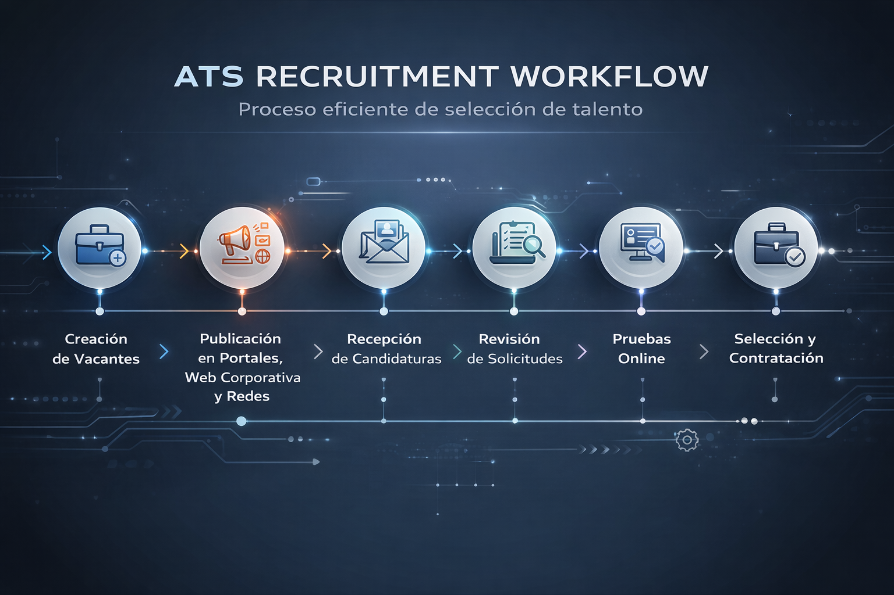
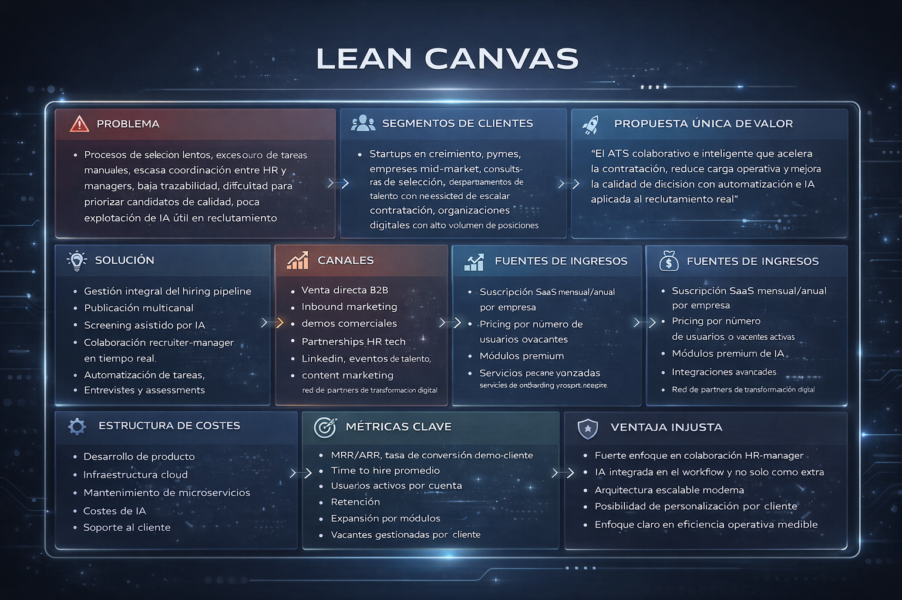

# PRD — LTI ATS  
## Applicant Tracking System inteligente, colaborativo y escalable

**Versión:** 1.0  
**Estado:** Draft PRD  
**Producto:** LTI ATS  
**Tipo de documento:** Product Requirements Document  
**Audiencia:** Dirección, Product, Tecnología, UX, Arquitectura, Operaciones, Stakeholders de negocio  

---

## 1. Resumen ejecutivo

**LTI ATS** es una plataforma SaaS de **Applicant Tracking System** diseñada para optimizar y modernizar de extremo a extremo el proceso de captación y selección de talento. Su objetivo es ayudar a las organizaciones a **contratar mejor, más rápido y con mayor trazabilidad**, reduciendo la carga operativa del área de HR y mejorando la colaboración con hiring managers.

El sistema cubre todas las fases clave del proceso de selección:

1. **Creación de vacantes**  
2. **Publicación en portales, web corporativa y redes sociales**  
3. **Recepción de candidaturas**  
4. **Revisión y filtrado de solicitudes**  
5. **Pruebas online y assessments**  
6. **Planificación y ejecución de entrevistas**  
7. **Selección final y contratación**

  

La propuesta de valor de LTI ATS se fundamenta en cuatro capacidades estratégicas:

- **Eficiencia operativa para HR**
- **Colaboración en tiempo real entre recruiters y managers**
- **Automatización de tareas y flujos**
- **Asistencia de IA integrada en tareas críticas del recruiting**

---

## 2. Visión del producto

Construir un ATS de nueva generación que no solo gestione candidatos, sino que actúe como una **plataforma inteligente de decisión y colaboración** para equipos de talento.

LTI ATS debe diferenciarse de los sistemas tradicionales por ofrecer:

- una experiencia moderna y rápida
- procesos configurables por tipo de vacante
- inteligencia operativa basada en datos
- automatizaciones configurables
- IA útil y gobernada dentro del flujo real de trabajo

---

## 3. Objetivo del producto

Desarrollar una solución ATS capaz de convertirse en una pieza central del ecosistema HR de empresas en crecimiento, pymes digitalizadas y organizaciones con necesidades de escalado en contratación.

### Objetivos principales

- Reducir el tiempo medio de contratación (**time to hire**)
- Mejorar la productividad del equipo de recruiting
- Aumentar la calidad y consistencia de la evaluación
- Mejorar la coordinación entre HR y managers
- Ofrecer una experiencia superior para candidatos y entrevistadores
- Permitir escalabilidad funcional y técnica del producto

---

## 4. Problema a resolver

Los procesos de selección suelen presentar ineficiencias estructurales:

- exceso de tareas manuales
- baja visibilidad del estado real de cada vacante
- coordinación lenta entre recruiters y responsables de negocio
- dificultades para comparar candidatos de forma homogénea
- uso fragmentado de correo, hojas de cálculo y herramientas aisladas
- poca trazabilidad de decisiones
- baja explotación práctica de la IA en recruiting

Estas limitaciones impactan directamente en:

- tiempos de cobertura de posiciones
- coste operativo del proceso
- experiencia del candidato
- capacidad de escalar contratación sin ampliar estructura de HR

---

## 5. Propuesta de valor

**LTI ATS** centraliza, automatiza e impulsa con IA todo el proceso de selección, permitiendo que las organizaciones contraten con mayor velocidad, mejor alineación y más calidad de decisión.

### Valor diferencial

#### 5.1 Eficiencia para HR
Automatización de tareas repetitivas, reutilización de plantillas, centralización del candidato y reducción del trabajo administrativo.

#### 5.2 Colaboración real
Recruiters y managers trabajan sobre una misma plataforma con comentarios, scorecards, estados compartidos y notificaciones en tiempo real.

#### 5.3 Automatización inteligente
Flujos configurables por etapa, recordatorios automáticos, cambios de estado, envío de comunicaciones y activación de pruebas o entrevistas.

#### 5.4 IA aplicada
Asistencia en redacción de ofertas, screening, matching, generación de resúmenes, sugerencia de preguntas y apoyo a la decisión final.

---

## 6. Alcance funcional

El producto debe cubrir de forma integral el ciclo de reclutamiento mostrado en el proceso objetivo.

### 6.1 Creación de vacantes

Permite crear una nueva posición de forma estructurada y estandarizada.

**Capacidades esperadas:**
- creación manual de vacantes
- uso de plantillas reutilizables
- campos configurables por tipo de puesto
- definición de:
  - título
  - descripción
  - departamento
  - modalidad
  - ubicación
  - seniority
  - skills requeridas
  - rango salarial
  - tipo de contrato
- workflow de aprobación de vacantes
- versionado o histórico de cambios
- clonación de vacantes previas

**Valor aportado:**  
Acelera la apertura de procesos y mejora la consistencia de la información publicada.

---

### 6.2 Publicación multicanal

Permite distribuir una vacante en varios canales desde un único punto de control.

**Capacidades esperadas:**
- publicación en web corporativa
- publicación en job boards
- publicación en redes profesionales y sociales
- landing de empleo corporativa
- tracking del canal de origen
- borradores y previsualización de publicación
- configuración de formularios de candidatura
- gestión del estado de publicación

**Valor aportado:**  
Mejora el alcance de las ofertas y permite medir qué fuentes generan mejores candidatos.

---

### 6.3 Recepción de candidaturas

Centraliza el registro de candidatos y evita la dispersión de información.

**Capacidades esperadas:**
- recepción automática desde formularios y fuentes externas
- parsing de CV
- generación de perfil unificado de candidato
- almacenamiento de CV y adjuntos
- deduplicación de candidatos
- etiquetado y categorización
- gestión de consentimientos y cumplimiento normativo

**Valor aportado:**  
Construye una base de talento reutilizable y mejora el control sobre la información del candidato.

---

### 6.4 Revisión y screening

Permite revisar, clasificar y priorizar candidaturas de forma rápida y trazable.

**Capacidades esperadas:**
- pipeline visual por fases
- filtros avanzados
- scorecards configurables
- ranking y shortlisting
- motivos de descarte estructurados
- seguimiento del histórico del candidato
- vistas por recruiter, vacante o estado

**IA aplicada:**
- resumen automático de CV
- matching con requisitos del puesto
- sugerencia de priorización
- detección de fortalezas y gaps
- extracción de información clave

**Valor aportado:**  
Reduce tiempos de screening y mejora la calidad de la preselección.

---

### 6.5 Online tests y assessments

Integra evaluaciones previas a entrevistas o fases finales.

**Capacidades esperadas:**
- envío automático de pruebas
- tests propios configurables
- integración con plataformas externas
- evaluación técnica, psicométrica, idiomática o lógica
- registro de resultados
- visibilidad consolidada en ficha del candidato

**IA aplicada:**
- recomendación de prueba adecuada
- análisis de respuestas abiertas
- detección de anomalías o inconsistencias

**Valor aportado:**  
Mejora la capacidad de evaluación objetiva antes de invertir tiempo en entrevistas.

---

### 6.6 Gestión de entrevistas

Facilita la coordinación entre recruiter, manager y candidato.

**Capacidades esperadas:**
- programación manual o asistida
- sincronización con calendarios
- confirmaciones automáticas
- recordatorios automáticos
- entrevistas individuales y paneles
- feedback estructurado por entrevista
- histórico de evaluaciones

**IA aplicada:**
- sugerencia de franjas horarias óptimas
- propuesta de preguntas según perfil y vacante
- resumen consolidado de feedback
- identificación de feedback contradictorio

**Valor aportado:**  
Disminuye la fricción organizativa y mejora la calidad del proceso de entrevista.

---

### 6.7 Selección final y contratación

Facilita la decisión final y el cierre del proceso.

**Capacidades esperadas:**
- comparación entre finalistas
- consolidación de feedback
- aprobación interna de oferta
- generación asistida de carta oferta
- seguimiento de aceptación o rechazo
- exportación o integración con HRIS / onboarding

**IA aplicada:**
- resumen ejecutivo del finalista
- recomendación argumentada
- generación de borradores de comunicación

**Valor aportado:**  
Acorta el tiempo hasta la contratación y mejora la trazabilidad de la decisión.

---

## 7. Capacidades transversales

### 7.1 Colaboración en tiempo real

**Objetivo:** convertir el recruiting en un flujo realmente compartido entre HR y negocio.

**Funcionalidades esperadas:**
- comentarios sobre candidatos y vacantes
- menciones entre usuarios
- scorecards compartidas
- estados visibles para todos los implicados
- alertas y notificaciones en tiempo real
- auditoría de acciones
- tareas pendientes por usuario

---

### 7.2 Automatizaciones

**Objetivo:** reducir tareas manuales y escalar operaciones.

**Automatizaciones clave:**
- publicación automática tras aprobación
- asignación automática de recruiter
- emails automáticos por fase
- invitación automática a tests
- recordatorios de feedback pendiente
- actualización automática de estado
- cierre de vacante tras contratación
- clasificación automática en pools de talento

---

### 7.3 Asistencia de IA

**Objetivo:** acelerar tareas de alto impacto sin sustituir la decisión humana.

**Ámbitos de aplicación:**
- redacción de ofertas
- resumen de candidaturas
- matching entre perfil y puesto
- generación de preguntas de entrevista
- consolidación de feedback
- recomendaciones explicables
- soporte a reporting y analítica

**Principios de uso de IA:**
- explicabilidad
- supervisión humana
- trazabilidad
- configuración por cliente
- cumplimiento normativo y ético

---

### 7.4 Analytics y reporting

**Objetivo:** dar visibilidad del rendimiento operativo y de la calidad del proceso.

**KPIs principales:**
- time to hire
- time to fill
- ratio por fase
- conversión por fuente
- eficiencia por recruiter
- tiempo de respuesta del manager
- tasa de aceptación de oferta
- abandono en fases del funnel
- volumen de vacantes abiertas/cerradas
- uso de automatizaciones e IA

---

## 8. Usuarios objetivo

### 8.1 Recruiter / Talent Acquisition Specialist
Responsable de operar el pipeline, revisar candidatos, coordinar el proceso y asegurar avance.

### 8.2 HR Manager / Head of Talent
Responsable de supervisar el rendimiento del área, estandarizar procesos y analizar métricas.

### 8.3 Hiring Manager
Responsable de evaluar perfiles, colaborar en decisiones y aportar feedback de negocio.

### 8.4 Interviewer
Participa en entrevistas y aporta evaluaciones estructuradas.

### 8.5 Candidate
Interactúa con la plataforma a través de formularios, comunicaciones, pruebas y seguimiento del proceso.

### 8.6 Admin / Super Admin
Gestiona configuración, permisos, catálogos, integraciones y parametrización del sistema.

---

## 9. Requisitos funcionales de alto nivel

### RF-01. Gestión de vacantes
El sistema debe permitir crear, editar, publicar, pausar y cerrar vacantes.

### RF-02. Pipeline configurable
El sistema debe permitir definir fases del proceso por tipo de vacante.

### RF-03. Gestión de candidatos
El sistema debe centralizar fichas de candidato, documentos, historial e interacciones.

### RF-04. Publicación multicanal
El sistema debe permitir publicar ofertas en varios canales y registrar la fuente de origen.

### RF-05. Evaluación estructurada
El sistema debe soportar scorecards, feedback y comparativas de candidatos.

### RF-06. Colaboración en tiempo real
El sistema debe permitir comentarios, menciones y notificaciones entre usuarios internos.

### RF-07. Automatizaciones
El sistema debe soportar reglas automáticas configurables asociadas a eventos del proceso.

### RF-08. IA asistida
El sistema debe ofrecer asistencia de IA en tareas de redacción, screening, resumen y soporte a decisión.

### RF-09. Entrevistas
El sistema debe permitir planificar, registrar y evaluar entrevistas.

### RF-10. Reporting
El sistema debe ofrecer dashboards y métricas operativas y estratégicas.

### RF-11. Seguridad y roles
El sistema debe contar con control de acceso basado en roles y trazabilidad de acciones.

### RF-12. Integraciones
El sistema debe ser integrable con calendarios, correo, job boards, herramientas de assessment y sistemas HR.

---

## 10. Requisitos no funcionales

### 10.1 Escalabilidad
La arquitectura debe soportar crecimiento en clientes, vacantes, candidatos y eventos sin degradación significativa.

### 10.2 Disponibilidad
El sistema debe aspirar a una alta disponibilidad, adecuada a un servicio SaaS B2B.

### 10.3 Rendimiento
Las operaciones críticas del usuario deben responder con baja latencia en condiciones normales de uso.

### 10.4 Seguridad
Debe incluir autenticación robusta, gestión de roles, trazabilidad, cifrado y cumplimiento de buenas prácticas.

### 10.5 Auditabilidad
Las acciones relevantes deben quedar registradas con usuario, fecha y contexto.

### 10.6 Mantenibilidad
La solución debe favorecer evolución modular, testing automatizado y despliegues desacoplados.

### 10.7 Observabilidad
Debe contemplar métricas técnicas, logs, trazas y alertas operativas.

### 10.8 Cumplimiento
Debe facilitar cumplimiento de protección de datos, consentimiento y políticas de retención.

---

## 11. Propuesta de valor diferencial adicional

Además de los requisitos identificados, se recomiendan los siguientes diferenciales estratégicos:

### 11.1 Talent CRM
Base de talento reutilizable, campañas de nurturing y recuperación de candidatos pasivos.

### 11.2 Career Site Builder
Constructor de portal de empleo con branding, contenido dinámico y enfoque SEO.

### 11.3 Hiring Intelligence
Análisis de cuellos de botella, calidad por fuente, tiempos de respuesta y predicciones de fricción.

### 11.4 Candidate Experience Hub
Portal para candidatos con estado del proceso, comunicaciones y experiencia más transparente.

### 11.5 Marketplace de integraciones
Modelo extensible con conectores a ecosistema HR Tech.

### 11.6 IA explicable
Recomendaciones justificadas y siempre bajo control humano.

### 11.7 Soporte multiempresa
Preparación para evolución SaaS B2B con tenants aislados y configuraciones por cliente.

---

## 12. Lean Canvas

| Bloque | Contenido |
|---|---|
| **Problema** | Procesos de selección lentos, tareas manuales, escasa coordinación entre HR y managers, baja trazabilidad y débil uso práctico de IA. |
| **Segmentos de clientes** | Startups en crecimiento, pymes, empresas mid-market, consultoras de selección, organizaciones con alto volumen de contratación. |
| **Propuesta única de valor** | ATS colaborativo e inteligente que acelera la contratación, reduce carga operativa y mejora la calidad de decisión mediante automatización e IA aplicada. |
| **Solución** | Gestión integral del pipeline de selección, publicación multicanal, screening asistido por IA, colaboración en tiempo real, automatizaciones, entrevistas y analytics. |
| **Canales** | Venta directa B2B, inbound marketing, demos comerciales, partners HR Tech, LinkedIn, eventos del sector y content marketing. |
| **Fuentes de ingresos** | Suscripción SaaS mensual/anual, pricing por usuarios o vacantes activas, módulos premium de IA, integraciones avanzadas, onboarding y soporte enterprise. |
| **Estructura de costes** | Desarrollo de producto, infraestructura cloud, microservicios, costes de IA, soporte, ventas, marketing, seguridad y compliance. |
| **Métricas clave** | MRR/ARR, conversión demo-cliente, time to hire, uso activo por cuenta, retención, expansión, vacantes gestionadas y adopción de automatizaciones/IA. |
| **Ventaja injusta** | Integración real de colaboración HR-manager, IA embebida en workflow, arquitectura moderna escalable y orientación a eficiencia medible. |

  

---

## 13. Arquitectura tecnológica recomendada

Dado el contexto del equipo, la combinación de **Vue + microservicios con Spring Boot** es adecuada para construir una solución escalable, mantenible y moderna.

### 13.1 Frontend
**Vue 3**
- interfaz dinámica y modular
- buena experiencia para dashboards y pipelines visuales
- ideal para componentes colaborativos en tiempo real

### 13.2 Backend
**Spring Boot con microservicios**
- separación clara por dominios funcionales
- escalabilidad independiente
- mayor facilidad de evolución y despliegue

### 13.3 Dominios sugeridos
- Job Service
- Candidate Service
- Application Service
- Interview Service
- Assessment Service
- Notification Service
- Workflow / Automation Service
- AI Assistant Service
- Analytics Service
- Auth & Permissions Service

### 13.4 Componentes recomendados
- **PostgreSQL** para persistencia principal
- **Redis** para caché y soporte transaccional rápido
- **Kafka o RabbitMQ** para eventos y automatizaciones
- **Elasticsearch / OpenSearch** para búsqueda avanzada
- **WebSockets** para colaboración en tiempo real
- **Keycloak** o solución IAM equivalente
- **Docker y Kubernetes** para despliegue cloud-native

---

## 14. Roadmap sugerido por fases

### Fase 1 — MVP
- gestión de vacantes
- publicación básica
- recepción de candidaturas
- pipeline visual
- feedback y scorecards
- entrevistas
- reporting básico

### Fase 2 — Escalado operativo
- automatizaciones configurables
- integraciones con calendarios y correo
- assessments
- dashboards avanzados
- base de talento reutilizable

### Fase 3 — Diferenciación
- copiloto IA
- matching inteligente
- recomendaciones explicables
- career site builder
- candidate experience hub

### Fase 4 — Expansión
- marketplace de integraciones
- soporte multiempresa avanzado
- analítica predictiva
- capacidades enterprise

---

## 15. Riesgos y consideraciones

### Riesgos funcionales
- exceso de complejidad en configuración inicial
- automatizaciones difíciles de gobernar si no se diseñan con claridad
- resistencia al cambio por parte de usuarios acostumbrados a procesos manuales

### Riesgos técnicos
- sobrecarga temprana por microservicios si no se acota bien el MVP
- complejidad de integraciones externas
- alta exigencia de trazabilidad y seguridad en datos sensibles

### Riesgos de producto
- competir en un mercado con soluciones maduras
- necesidad de diferenciarse claramente más allá de “tener IA”
- equilibrio entre facilidad de uso y profundidad funcional

---

## 16. Criterios de éxito

Se considerará que el producto avanza correctamente si consigue:

- reducir significativamente el tiempo de screening
- mejorar el tiempo total de contratación
- incrementar la participación efectiva de managers
- aumentar la trazabilidad del proceso
- mejorar la satisfacción de usuarios internos
- demostrar uso recurrente de automatizaciones e IA
- conseguir una adopción sólida en clientes piloto

---

## 17. Conclusión

**LTI ATS** tiene potencial para posicionarse como un **ATS moderno, colaborativo e inteligente**, especialmente atractivo para empresas que desean profesionalizar y escalar su función de talento.

La oportunidad estratégica no está solo en digitalizar el proceso de recruiting, sino en construir una plataforma que aporte:

- velocidad operativa
- mejores decisiones
- alineación entre HR y negocio
- automatización real
- inteligencia aplicada de forma útil y responsable

La elección tecnológica basada en **Vue y Spring Boot con arquitectura de microservicios** ofrece una base coherente para evolucionar el producto desde un MVP sólido hasta una solución SaaS B2B competitiva y escalable.

---

## 18. Anexo — Mensaje de posicionamiento

> **LTI ATS es el sistema de selección inteligente que ayuda a equipos de talento a contratar mejor y más rápido, conectando automatización, colaboración e IA en una sola plataforma.**
